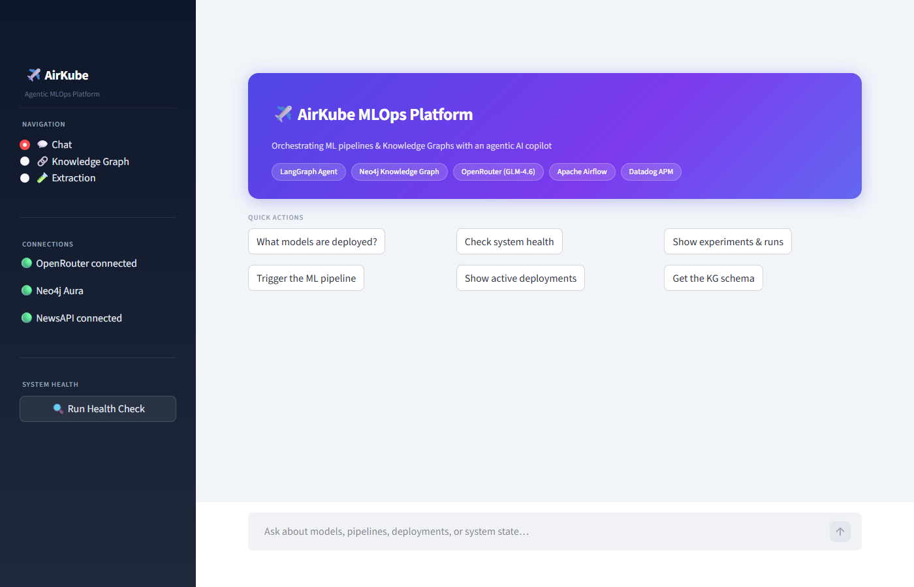
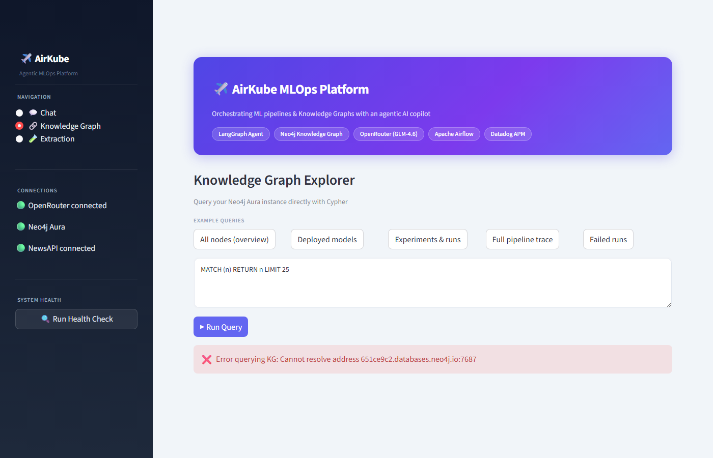
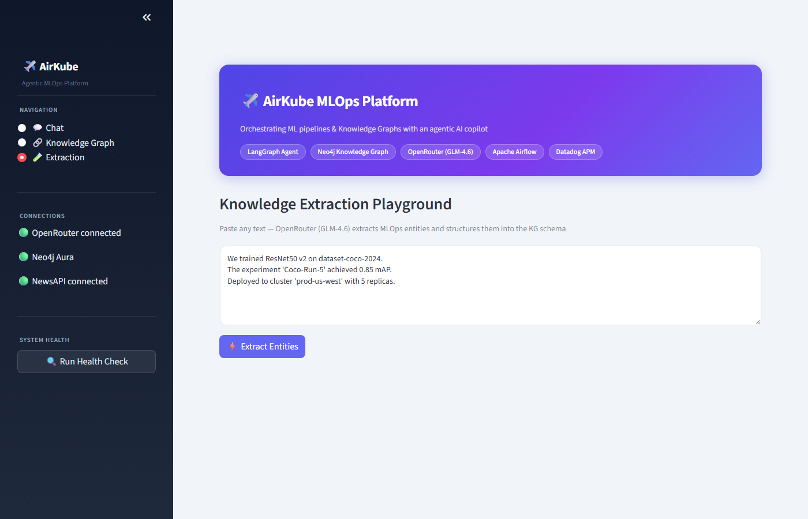

# AirKube

An agentic MLOps platform that combines a **LangGraph + OpenRouter (GLM-4.6)-powered AI agent**, a **Knowledge Graph** (Neo4j), an **ML inference API** (FastAPI), and a **news data pipeline** (Airflow + BigQuery) — all wired together in a Streamlit dashboard with Datadog observability.

**Live demo:** https://airkube-dashboard-a4410b460d07.herokuapp.com/

---

## What it does

The dashboard gives you three views:

- **Chat** — talk to the AirKube agent. It can query the knowledge graph, trigger Airflow pipelines, and check system health.
- **Knowledge Graph Explorer** — run Cypher queries directly against Neo4j to explore models, experiments, runs, and deployments. Queries run in a read-only transaction (both here and from the agent's `query_knowledge_graph` tool), so write clauses like `CREATE`/`MERGE`/`DELETE` get rejected at the driver level, not just filtered out with a regex.
- **Extraction Playground** — paste any text and the agent extracts MLOps entities (models, datasets, experiments, deployments) using OpenRouter (GLM-4.6).

---

## Screenshots

Captured running the dashboard locally against a live Neo4j Aura instance (the public demo above currently points at a stale/unreachable Aura instance — see [#2](https://github.com/iamvisheshsrivastava/AirKube/issues/2) and [#3](https://github.com/iamvisheshsrivastava/AirKube/issues/3)).

**Landing page** — the three-view navigation and connection status sidebar:



**Knowledge Graph Explorer** — a real Cypher query (`MATCH (n) RETURN n LIMIT 25`) run through the read-only driver. This particular run shows the honest failure mode when the configured Aura instance isn't reachable, rather than a raw traceback:



**Extraction Playground** — free text ready to be parsed into MLOps entities (model, experiment, deployment) via OpenRouter:



---

## Architecture

```
┌─────────────────────────────────────────────────────┐
│                  Streamlit Dashboard                │
│   Chat  │  KG Explorer  │  Extraction Playground   │
└──────────────────────┬──────────────────────────────┘
                       │
          ┌────────────▼────────────┐
          │   LangGraph Agent       │
          │   (OpenRouter GLM-4.6)  │
          └──┬──────────┬───────────┘
             │          │
    ┌─────────▼──┐  ┌───▼──────────────┐
    │  Neo4j KG  │  │  FastAPI         │
    │  (Models,  │  │  Inference API   │
    │  Runs,     │  │  /predict        │
    │  Deploys)  │  │  /batch-predict  │
    └────────────┘  └──────────────────┘
             │
    ┌────────▼──────────────────────┐
    │  Airflow DAGs                 │
    │  ml_pipeline  │  kg_pipeline  │
    │  news_data_pipeline           │
    └────────┬──────────────────────┘
             │
    ┌────────▼──────────────┐
    │  BigQuery + GCS       │
    │  dbt transformation   │
    └───────────────────────┘
```

**Observability:** Datadog APM traces every API request and agent invocation in production.

---

## Tech Stack

| Layer | Technology |
|---|---|
| Agent | LangGraph, OpenRouter (GLM-4.6) |
| Dashboard | Streamlit |
| Inference API | FastAPI, scikit-learn |
| Knowledge Graph | Neo4j |
| Orchestration | Apache Airflow |
| Data Warehouse | BigQuery, GCS |
| Transformation | dbt |
| Observability | Datadog (APM + Logs) |
| Deployment | Heroku |
| Containers | Docker, Docker Compose |

---

## Project Structure

```
AirKube/
├── dashboard.py          # Streamlit app (deployed to Heroku)
├── run_agent.py          # CLI entry point for the agent
├── Procfile              # Heroku: runs the dashboard
├── Procfile.api          # Heroku: runs the inference API
│
├── agent/
│   ├── graph.py          # LangGraph state machine
│   ├── state.py          # Agent state definition
│   └── tools.py          # Agent tools (KG query, pipeline trigger, health check)
│
├── ml/
│   ├── inference.py      # FastAPI app (/predict, /batch-predict, /health)
│   ├── model.py          # Model loading and prediction
│   ├── model.pkl         # Trained Random Forest (Iris)
│   ├── schemas.py        # API Pydantic models
│   ├── kg_utils.py       # Neo4j connector
│   ├── kg_schemas.py     # KG entity schemas
│   ├── kg_extraction.py  # LLM-based entity extraction
│   ├── kg_ingestion.py   # Neo4j write helpers
│   ├── kg_validation.py  # Extraction validation
│   ├── news_pipeline.py  # News ETL helpers
│   ├── news_schemas.py   # News data models
│   ├── news_integration.py # ML pipeline handoff
│   ├── train_model.py    # Model training script
│   └── env.py            # .env loader
│
├── dags/
│   ├── ml_pipeline.py        # Train + log model with MLflow
│   ├── kg_pipeline.py        # Extract entities → Neo4j
│   └── news_data_pipeline.py # NewsAPI → GCS → BigQuery → dbt
│
├── dbt/                  # BigQuery staging + mart models
├── sql/                  # BigQuery schema and ELT scripts
├── tests/                # pytest suite
└── docker/               # Dockerfile for containerised deployment
```

---

## Running Locally

### 1. Clone and install

```bash
git clone https://github.com/iamvisheshsrivastava/AirKube.git
cd AirKube
pip install -r requirements.txt
```

### 2. Set up environment

```bash
cp .env.example .env
# Fill in: OPENROUTER_API_KEY, NEO4J_URI/USER/PASSWORD, DD_API_KEY
```

### 3. Start the dashboard

```bash
streamlit run dashboard.py
# → http://localhost:8501
```

### 4. Start the inference API

```bash
uvicorn ml.inference:app --reload
# → http://localhost:8000
```

### 5. Full local stack (requires Docker)

```bash
# Set NEO4J_AUTH and NEO4J_PASSWORD in .env first
docker compose up
```

This starts Airflow (`:8080`), Neo4j (`:7474`), the API (`:8000`), and the dashboard (`:8501`).

### 6. Run the CLI agent

```bash
python run_agent.py
```

---

## Environment Variables

| Variable | Required | Description |
|---|---|---|
| `OPENROUTER_API_KEY` | Yes | OpenRouter API key |
| `OPENROUTER_MODEL` | No | Model name (default: `z-ai/glm-4.6`) |
| `NEO4J_URI` | No | Neo4j connection URI (default: `bolt://localhost:7687`) |
| `NEO4J_USER` | No | Neo4j username |
| `NEO4J_PASSWORD` | No | Neo4j password |
| `AIRFLOW_BASE_URL` | For pipeline triggers | Airflow REST API base URL, e.g. `http://localhost:8080` |
| `AIRFLOW_USERNAME` / `AIRFLOW_PASSWORD` | For pipeline triggers | Airflow basic-auth credentials. Without all three Airflow vars, the agent's `trigger_ml_pipeline`/`trigger_news_data_pipeline` tools say so explicitly instead of pretending a DAG run started |
| `NEWS_API_KEY` | For news pipeline | NewsAPI.org key |
| `GCP_PROJECT_ID` | For news pipeline | GCP project ID |
| `NEWS_GCS_BUCKET` | Optional | GCS bucket for raw news data |
| `API_KEY` | Optional | Shared secret for the inference API. Unset by default (open, as on the public demo) — set it to require an `X-API-Key` header on `/predict`, `/batch-predict`, and the KG lookup routes |
| `DD_API_KEY` | Production | Datadog API key |
| `DD_APP_KEY` | Production | Datadog application key |
| `DD_SITE` | Production | Datadog site (e.g. `datadoghq.com`) |

See [.env.example](.env.example) for the full list.

---

## Tests

```bash
pip install -r requirements-dev.txt
pytest tests/
```

---

## Deployment

The dashboard is deployed to Heroku. On every push to `main`, redeploy with:

```bash
git push heroku main
```

Config vars are managed via Heroku dashboard or the Heroku API.
